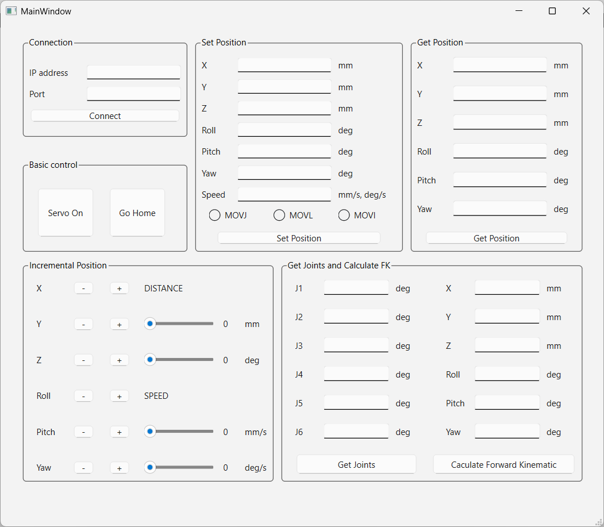

# yrc1000_UDP_command



## Overview

**yrc1000_UDP_command** is a Qt C++ graphical interface designed for communicating with a **Yaskawa YRC1000** robot controller via **UDP packets**. This tool allows for real-time robot control, position monitoring, and basic kinematic calculations from your PC.

---

## Features

### 🔌 Connect Box
- Set the **IP address** and **Port ID** to connect with the YRC1000 controller over UDP.

### 🎮 Control Buttons
- **Servo On/Off**: Enable or disable the robot's servo power.
- **Go Home**: Send the robot to its predefined home position.

### 🎯 Set Position
- Move the robot using:
  - **Joint** motion
  - **Linear** (Cartesian) motion
  - **Incremental** steps

### 📡 Get Position
- Retrieve and display the robot's current position in:
  - **Joint space** (degrees)
  - **Cartesian space** (XYZ + orientation)

### 🧮 Calculation
- Perform **Forward Kinematics** based on joint positions.

---

## Screenshot

Main GUI interface:


---

## Technologies Used

- **Language**: C++
- **Framework**: Qt (Widgets)
- **Communication**: UDP protocol
- **Platform**: Desktop (Linux/Windows)

---

## Getting Started

### Prerequisites

- Qt (5.x or 6.x)
- A C++ compiler (e.g., GCC, MSVC)
- YRC1000 robot controller
- Ethernet connection on the same subnet

### Build Instructions

```bash
git clone https://github.com/your-username/yrc1000_UDP_command.git
cd yrc1000_UDP_command
qmake && make
